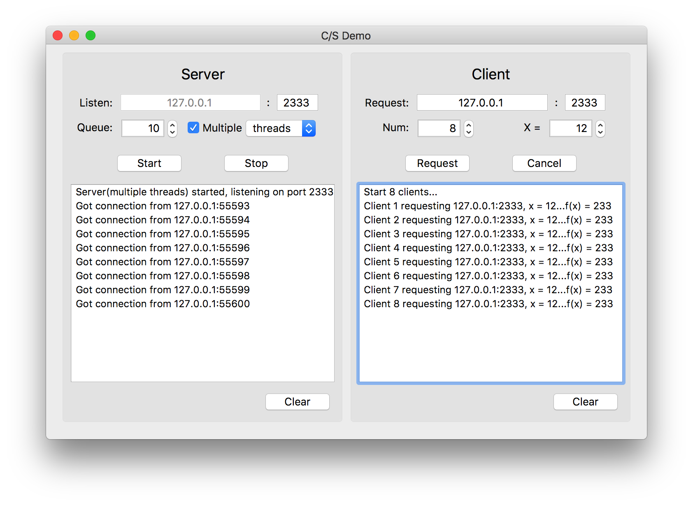

# Client-server Demo

这是我在 XJTU 学习操作系统课程时所做的实验项目。最初是在命令行下实现了 C/S 结构，后来用 Qt 做了界面美化。仅供学习用途。

## 原理

基于 C 中的 socket 库，服务器和客户端通过建立 socket 进行通信。客户端发送一个整数值 $x$ 给服务器，服务器计算函数 $f(x)$ 并返回。在这个程序中，$f(x)$ 递归地计算斐波那契数列的第 $x$ 项，时间复杂度 $O(2^n)$。

## 编译

### 命令行

项目根目录下的源代码都是可直接用 `g++` 编译的单文件。它们在命令行下运行：

* `server-single.cpp`：单线程服务器
* `server-mt.cpp`：多线程服务器
* `server-mp.cpp`：多进程服务器
* `client-single.cpp`：串行请求客户端
* `client-mt.cpp`：并发请求客户端

### Qt

Qt 项目在 qt-client-server 目录下，用 Qt Creator 打开编译即可。

## 操作方法

左边是服务器控制面板，可以设置服务器的监听端口、等待队列中最多可以容纳的请求数量、和服务器类型（单线程、多线程（pthread）、多进程（fork））。

右边是客户端控制面板，可以设置客户端的请求地址、并发请求的数量、和 $x$ 的值。注意不要将 $x$ 或 $Num$ 设置过大的值，否则可能导致程序无响应。

## 支持

在 macOS 下编译，理论支持 Linux。由于用到了 `pthread` 和 `fork`，所以是不支持原生 Windows 的。

## 反馈与交流

如果你发现 bug 或者有更好的建议，欢迎通过邮件与我联系。